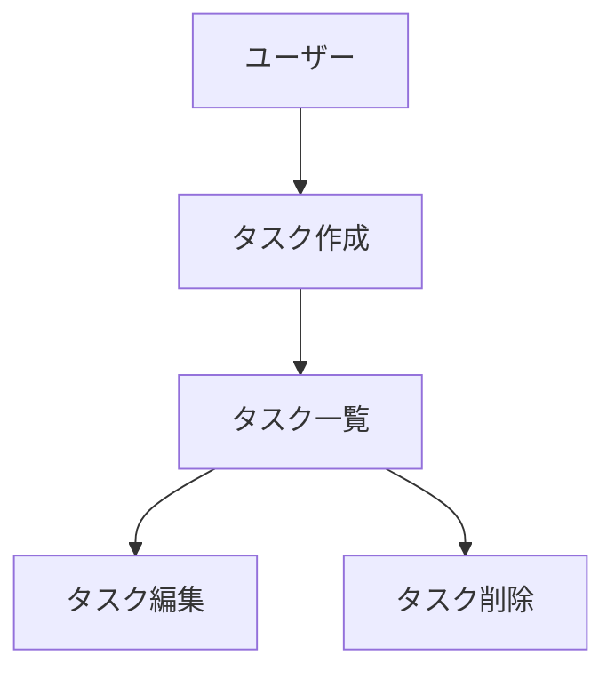

# ドキュメント管理の原則

## 永続的ドキュメント（`docs_for_ai/`）
- アプリケーションの基本設計を記述
- 頻繁に更新されない
- 大きな設計変更時のみ更新
- プロジェクト全体の「北極星」として機能

## 作業単位のドキュメント（`.steering/`）
- 特定の作業・変更に特化
- 作業ごとに新しいディレクトリを作成
- 作業完了後は履歴として保持
- 変更の意図と経緯を記録

---

# 図表・ダイアグラムの記載ルール

## 記載場所

設計図やダイアグラムは、関連する永続的ドキュメント内に直接記載します。
独立したdiagramsフォルダは作成せず、手間を最小限に抑えます。

**配置例：**
- ER図、データモデル図 → `functional-design.md` 内に記載
- ユースケース図 → `functional-design.md` または `product-requirements.md` 内に記載
- 画面遷移図、ワイヤフレーム → `functional-design.md` 内に記載
- システム構成図 → `functional-design.md` または `architecture.md` 内に記載

## 記述形式

1. **Mermaid記法（推奨）**
   - Markdownに直接埋め込める
   - バージョン管理が容易
   - ツール不要で編集可能



2. **ASCII アート**
   - シンプルな図表に使用
   - テキストエディタで編集可能

```
┌─────────────┐
│   Header    │
└─────────────┘
       │
       ↓
┌─────────────┐
│  Task List  │
└─────────────┘
```

3. **画像ファイル（必要な場合のみ）**
   - 複雑なワイヤフレームやモックアップ
   - `docs_for_ai/images/` フォルダに配置
   - PNG または SVG 形式を推奨

## 図表の更新
- 設計変更時は対応する図表も同時に更新
- 図表とコードの乖離を防ぐ
