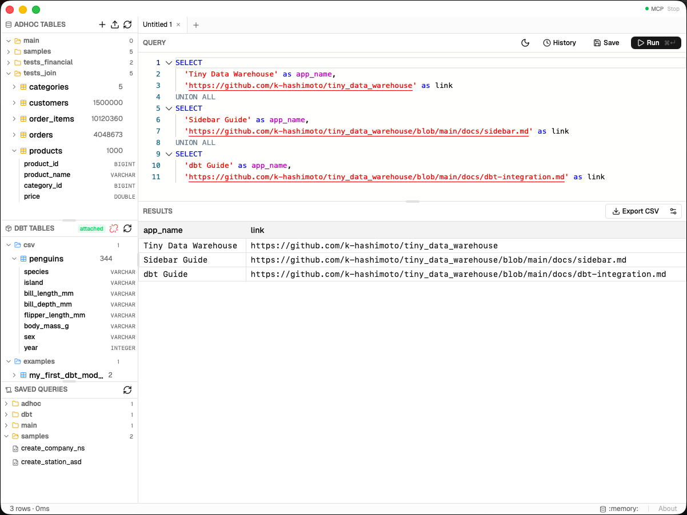

# Tiny Data Warehouse



> [!WARNING]
> **This is alpha-quality software.** It has not been adequately tested and may crash, corrupt data, or behave unexpectedly. Use at your own risk.

**Concept: A minimal data warehouse you can try out effortlessly.** Tiny Data Warehouse is a lightweight desktop SQL client powered by [DuckDB](https://duckdb.org/), built with [Tauri](https://tauri.app/) and React. Designed for personal data exploration, local analytics, and seamless integration with [dbt](https://www.getdbt.com/).

> 🇯🇵 [日本語版 README はこちら](./README.ja.md)

---

## Installation (macOS)

Run the following command in Terminal to download and install the app automatically:

```bash
curl -fsSL https://raw.githubusercontent.com/k-hashimoto/tiny_data_warehouse/main/install.sh | bash
```

This script downloads the latest release from GitHub, installs it to `/Applications`, and removes the macOS quarantine flag — no manual steps required.

> **Manual installation:** You can also download the `.dmg` from the [Releases](../../releases) page. Since this app is not code-signed, macOS may show a "damaged" error. Run the following command to fix it:
>
> ```bash
> xattr -dr com.apple.quarantine /Applications/Tiny\ Data\ Ware\ House.app
> ```

---

## Features

- **SQL Editor** — Monaco-based editor with syntax highlighting, multi-tab support, and query history
- **Table Explorer** — Browse schemas and tables in your local DuckDB database
- **CSV Import / Export** — Import CSV files as tables; export query results to CSV
- **dbt Integration** — Automatically detects and reflects changes to your dbt output database (`dbt.db`) in real time
- **Script Manager** — Save, rename, and reuse frequently used SQL scripts
- **Table Metadata** — Add comments to tables and columns for documentation
- **Dark Mode** — Toggle between light and dark themes
- **Resizable Layout** — Drag panels to customize your workspace

---

## Data Storage

All data is stored locally under `~/.tdwh/`:

```
~/.tdwh/
└── db/
    ├── app.db   # Your main DuckDB database
    └── dbt.db   # dbt output database (auto-detected)
```

No data is sent to any external server.

---

## dbt Integration

Tiny Data Warehouse watches `~/.tdwh/db/dbt.db` for changes. When a `dbt run` completes, the Explorer panel automatically refreshes to show the latest models — no manual reload needed.

To connect your dbt project, configure its output path to write `dbt.db` into `~/.tdwh/db/`.

Sample dbt projects are available in the [`dbt_examples/`](./dbt_examples/) directory to help you get started.

---

## Getting Started

### Prerequisites

- [Node.js](https://nodejs.org/) (v18 or later)
- [Rust](https://www.rust-lang.org/tools/install) (stable toolchain)
- [Tauri CLI prerequisites](https://tauri.app/start/prerequisites/) for your OS

### Development

```bash
# Install dependencies
npm install

# Start the dev server (opens the app window automatically)
npm run tauri dev
```

### Build

```bash
# Build a release binary
npm run tauri build

# Or using Taskfile
task build
```

The compiled app will be output to `src-tauri/target/release/bundle/`.

---

## Tech Stack

| Layer | Technology |
|---|---|
| Desktop Framework | [Tauri 2](https://tauri.app/) |
| Database Engine | [DuckDB](https://duckdb.org/) |
| Frontend | React 19 + TypeScript |
| SQL Editor | [Monaco Editor](https://microsoft.github.io/monaco-editor/) |
| UI Components | [shadcn/ui](https://ui.shadcn.com/) + Tailwind CSS v4 |
| State Management | [Zustand](https://zustand-demo.pmnd.rs/) |
| Build Tool | [Vite](https://vitejs.dev/) |

---

## Project Structure

```
tiny_data_warehouse/
├── src/                        # React frontend
│   ├── App.tsx                 # Root layout (resizable panels)
│   ├── components/
│   │   ├── Explorer/           # Table tree, dbt section, script list
│   │   ├── QueryEditor/        # Monaco editor, tab bar
│   │   ├── ResultsPanel/       # Query result table
│   │   ├── QueryHistory/       # History viewer
│   │   ├── CsvImport/          # CSV import dialog
│   │   └── StatusBar/          # Bottom status bar
│   └── store/                  # Zustand state
├── src-tauri/                  # Rust backend (Tauri)
│   └── src/
│       ├── commands/           # Tauri command handlers
│       │   ├── query.rs        # SQL execution
│       │   ├── explorer.rs     # Table/schema listing
│       │   ├── csv.rs          # CSV import/export
│       │   ├── scripts.rs      # Script management
│       │   ├── metadata.rs     # Table/column comments
│       │   └── config.rs       # Editor configuration
│       └── db/
│           ├── worker.rs       # Async DuckDB worker thread
│           ├── connection.rs   # DuckDB connection wrapper
│           └── types.rs        # Shared data types
└── Taskfile.yml                # Task runner shortcuts
```

---

## License

MIT

---

## Note

All code in this repository was generated by [Claude Code](https://claude.ai/code).
